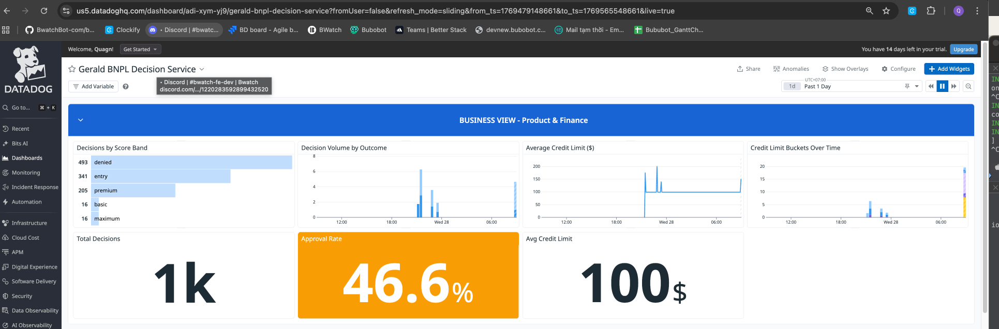
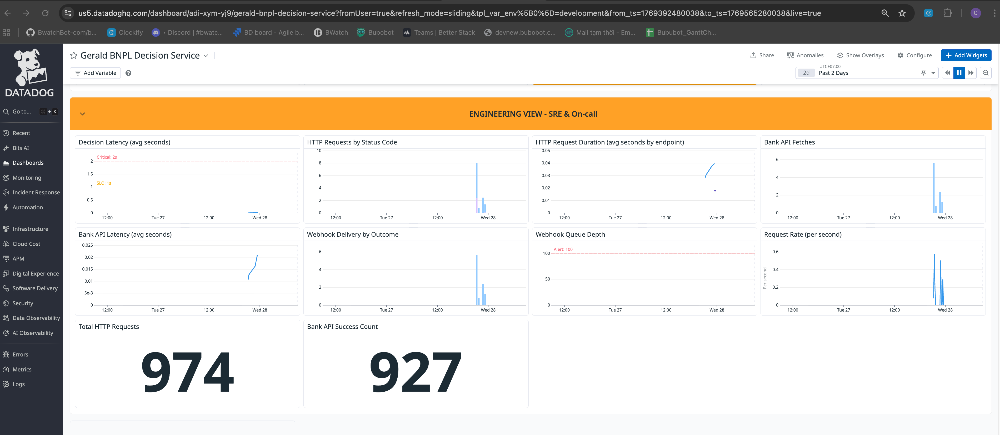

# Gerald BNPL Decision Service

A Buy Now, Pay Later credit decision engine built for Gerald's $0-fee model. This service evaluates user creditworthiness based on bank transaction data, assigns credit limits, and creates repayment plans.
---

### Demo video: 
https://drive.google.com/file/d/1DBC_sVaRiDdVpCU_r8a7Wi0TYuvK9n1I/view?usp=sharing
---

## 1. Architecture Overview

### System Flow

```
┌──────────┐     ┌──────────────┐     ┌──────────┐
│  Client  │────>│  FastAPI      │────>│ Bank API │
│          │<────│  Service      │<────│ (mock)   │
└──────────┘     │              │     └──────────┘
                 │  ┌────────┐  │
                 │  │Scoring │  │     ┌──────────┐
                 │  │Engine  │  │────>│PostgreSQL│
                 │  └────────┘  │     └──────────┘
                 │              │
                 │  ┌────────┐  │     ┌──────────┐
                 │  │Webhook │  │────>│ Ledger   │
                 │  │Service │  │     │ (mock)   │
                 │  └────────┘  │     └──────────┘
                 └──────────────┘
                        │
                 ┌──────────────┐
                 │  /metrics    │───> Prometheus/Datadog
                 └──────────────┘
```

When a user requests an advance, the flow is:

1. **Client hits the FastAPI service** at `POST /v1/decision` with a user ID and requested amount
2. **Service calls the Bank API** to fetch 90 days of transaction history — deposits, withdrawals, NSF flags
3. **Scoring engine** analyzes those transactions across four financial signals and produces a risk score from 0 to 100
4. **Score maps to a credit limit** — $0 for denied, up to $600 for excellent users
5. **Decision is persisted** to PostgreSQL with full audit trail
6. **Webhook fires** to the Ledger service to notify downstream systems
7. **Prometheus metrics** are emitted at every step — decision outcomes, latencies, error rates
8. **Datadog agent** scrapes those metrics and feeds the monitoring dashboard

### Key Design Decisions

- **Synchronous decision path** — the user gets an answer in one request, typically under 200ms. No queuing, no polling.
- **Structured logging with request tracing** — every log line carries a `request_id` so you can trace a single decision end-to-end across Bank API calls, scoring, DB writes, and webhooks.
- **Prometheus metrics at every boundary** — not just HTTP status codes, but business metrics like approval rate, score band distribution, and credit limit averages. This lets Product and Engineering share a single dashboard.
- **All infrastructure as code** — Datadog monitors and dashboard are deployed via Terraform, so alert definitions are version-controlled and reviewable.

### Key Files

| Path | Purpose |
|------|---------|
| `service/main.py` | FastAPI app, middleware, metrics endpoint |
| `service/api/routes.py` | API route handlers |
| `service/scoring/calculator.py` | Risk scoring logic (documented thresholds) |
| `service/scoring/credit_limit.py` | Score-to-limit mapping |
| `service/services/decision.py` | Decision orchestration |
| `service/services/bank_client.py` | Bank API client |
| `service/services/webhook.py` | Webhook delivery with retries |
| `service/metrics.py` | Prometheus metric definitions |
| `service/logging.py` | Structured logging with request tracing |
| `terraform/monitors.tf` | Datadog alert definitions |
| `metrics/dashboard_datadog.json` | Datadog dashboard config |

---

## 2. Business Context

### Problem

Gerald needs to make real-time credit decisions for BNPL advances ($100-$600). Unlike traditional BNPL providers that rely on late fees and penalties to recover from defaults, Gerald operates a **$0-fee model** — every default directly impacts the bottom line. This means risk assessment must be more accurate and conservative than fee-based competitors.

### Approach

The service balances two competing goals:
1. **Approve users who will repay** — maximize user value and revenue from merchant fees
2. **Deny users likely to default** — protect Gerald since there's no fee revenue to offset losses

We use a **score-based system (0-100)** built from four financial signals extracted from bank transaction history. The score maps to tiered credit limits ($0-$600), ensuring higher-risk users get lower limits rather than blanket denials.

### Trade-offs

| Decision | Rationale |
|----------|-----------|
| **Conservative thresholds** | No fee revenue means defaults are pure loss. We'd rather under-approve than over-approve. |
| **Tiered limits over binary approve/deny** | A user scoring 45 gets $200 instead of $0. This captures marginal revenue while limiting exposure. |
| **Thin file penalty over denial** | New users aren't outright denied — they receive reduced limits. This allows user acquisition while managing uncertainty. |
| **Income regularity weighted lower** | Gig workers have irregular timing but stable totals. Penalizing timing would exclude a growing segment unfairly. |
| **90-day analysis window** | Balances recency (recent behavior matters most) with stability (need enough data to see patterns). |

---

## 3. Risk Logic

### Business Constraint

Gerald's model has a unique constraint: zero fees. Traditional BNPL providers charge late fees and penalties, so they can absorb some defaults. Gerald can't — every default is pure loss. That means the risk model has to be more conservative, but not so conservative that we turn away good users.

### Scoring Components (0-100 points)

**1. Average Daily Balance — 30 points max**

The user's financial cushion. Can they absorb a $300-$600 advance? Uses carry-forward logic — if there's no transaction on a given day, the previous balance carries over, so we get a true daily picture.

| Threshold | Points | Why |
|-----------|--------|-----|
| >= $1,000 | 30 | Can absorb a full BNPL advance ($600 max) |
| >= $500 | 25 | Can absorb smaller advances |
| >= $100 | 15 | Minimal cushion |
| >= $0 | 10 | At least not overdrawn |
| < $0 | 0 | Chronically negative — high risk |

**2. Income vs Spending Ratio — 30 points max**

Total deposits divided by total withdrawals. A ratio above 1.3 means the user earns 30% more than they spend — strong repayment capacity. Below 0.8 means significant cash burn.

| Threshold | Points | Why |
|-----------|--------|-----|
| >= 1.3 | 30 | 30% income surplus — strong repayment capacity |
| >= 1.1 | 25 | 10% surplus — healthy |
| >= 1.0 | 15 | Breakeven — risky but possible |
| >= 0.8 | 5 | 20% deficit — marginal |
| < 0.8 | 0 | Significant cash burn |

**3. NSF/Overdraft Count — 25 points max**

The strongest predictor of default. Counts both explicit NSF flags from the bank AND debit transactions that push the balance negative. Zero events = 25 points. Five or more = 0 points.

| Threshold | Points | Why |
|-----------|--------|-----|
| 0 events | 25 | Clean history |
| 1-2 events | 15 | May be one-time circumstance |
| 3-4 events | 5 | Pattern emerging |
| 5+ events | 0 | Chronic overdrafts |

**4. Income Regularity — 15 points max**

How predictable is the user's income timing? Intentionally weighted lower — only 15% of the score — because gig workers have irregular timing but can still be creditworthy.

| Threshold | Points | Why |
|-----------|--------|-----|
| >= 0.8 regularity | 15 | Very predictable (e.g., bi-weekly payroll) |
| >= 0.5 regularity | 10 | Somewhat predictable (steady gig work) |
| >= 0.3 regularity | 5 | Irregular but present |
| < 0.3 regularity | 0 | Highly unpredictable |

**5. Thin File Penalty — up to -30 points**

Applied when transaction history is limited. A penalty rather than outright denial — a user with few transactions but excellent metrics still gets a chance, just at a lower tier.

| Transactions | Penalty | Why |
|-------------|---------|-----|
| >= 30 | 0 | Sufficient history |
| 20-29 | -10 | Moderate uncertainty |
| 10-19 | -20 | Limited history |
| < 10 | -30 | Very thin — could be gaming or new account |

### Score-to-Limit Mapping

The score maps to tiered limits, not a binary approve/deny:

| Score | Band | Limit | Description |
|-------|------|-------|-------------|
| 0-19 | Denied | $0 | Too risky for $0-fee model |
| 20-39 | Entry | $100 | Limited trust, small advance |
| 40-54 | Basic | $200 | Moderate risk |
| 55-64 | Standard | $300 | Acceptable risk |
| 65-74 | Enhanced | $400 | Good financial health |
| 75-84 | Premium | $500 | Strong financial health |
| 85-100 | Maximum | $600 | Excellent — full limit |

A user scoring 45 gets $200 instead of nothing. We capture marginal revenue while limiting exposure.

### Edge Cases

- **Gig Workers:** Income regularity is only 15% of the total score. A gig worker with irregular timing but strong income ratio (1.3+) and good balance still scores 60+, qualifying for $300-$400 limits.
- **Thin Files:** Receive a penalty of -10 to -30 points. A user with only 3 transactions but excellent metrics scores ~40-55 instead of ~70-85, landing in entry/basic tier rather than premium.
- **Chronic Overdrafts:** Users with 5+ NSF events get 0 from NSF (25 points lost) and likely have low balance scores too. They typically score < 20 and are denied.
- **Zero Transactions:** Returns a score of 0 (denied). We can't make a decision without data.

---

## 4. How to Run

### Setup Instructions

**Prerequisites:**
- Docker and Docker Compose
- Python 3.12+
- Poetry (for local development)

**Environment setup:**
```bash
# Clone and enter the project
cd gerald_impact_engineer_takehome

# Copy environment file
cp .env.example .env

# Install Python dependencies (for local development/testing)
poetry install
```

### Starting the Service

**Option 1: Docker (recommended)**
```bash
# Start all services (DB, Bank mock, Ledger mock, Service)
docker compose up -d

# Verify service is running
curl http://localhost:8000/health
# → {"status": "ok", "service": "gerald-gateway"}

# Stop all services
docker compose down
```

**Option 2: Local development**
```bash
# Start dependencies only
docker compose up -d db bank ledger

# Run the service locally with hot reload
uvicorn service.main:app --reload --host 0.0.0.0 --port 8000
```

### Running Tests

```bash
# Unit tests (no external dependencies needed)
python -m pytest tests/test_risk_logic.py tests/test_scoring_sample.py -v

# Integration tests (requires running DB)
docker compose up -d db
python -m pytest tests/test_decision_integration.py -v

# All tests
python -m pytest tests/ -v
```

### Accessing Metrics/Dashboard

**Prometheus metrics endpoint:**
```bash
curl http://localhost:8000/metrics
```

**Datadog dashboard:**
- URL: https://us5.datadoghq.com/dashboard/adi-xym-yj9/gerald-bnpl-decision-service

**Deploy Datadog alerts (requires API keys):**
```bash
cd terraform/
terraform init
terraform apply \
  -var="datadog_api_key=YOUR_KEY" \
  -var="datadog_app_key=YOUR_KEY"
```

---

## 5. Demo

📍 **Full video script with scroll cues:** 

| Section | Duration | What to Show | Scroll To |
|---------|----------|--------------|-----------|
| Architecture | 2-3 min | System design | README → Section 1 (ASCII diagram) |
| Risk Logic | 2-3 min | Scoring explanation | README → Section 3 → "Scoring Components" table |
| Live Demo | 2-3 min | API calls in terminal | Terminal (full screen) |
| Dashboard | 1 min | Datadog metrics | Browser → Dashboard URL below |
| Trade-offs | 1-2 min | Design decisions | README → Section 6 |

**Dashboard URL:** https://us5.datadoghq.com/dashboard/adi-xym-yj9/gerald-bnpl-decision-service

### Show Different User Outcomes

```bash
# Good user — approved with high limit
curl -s -X POST http://localhost:8000/v1/decision \
  -H "Content-Type: application/json" \
  -d '{"user_id": "user_good", "amount_cents_requested": 40000}' | python -m json.tool

# Overdraft user — denied
curl -s -X POST http://localhost:8000/v1/decision \
  -H "Content-Type: application/json" \
  -d '{"user_id": "user_overdraft", "amount_cents_requested": 20000}' | python -m json.tool

# Gig worker — approved with moderate limit
curl -s -X POST http://localhost:8000/v1/decision \
  -H "Content-Type: application/json" \
  -d '{"user_id": "user_gig", "amount_cents_requested": 30000}' | python -m json.tool

# Thin file — reduced limit due to penalty
curl -s -X POST http://localhost:8000/v1/decision \
  -H "Content-Type: application/json" \
  -d '{"user_id": "user_thin", "amount_cents_requested": 20000}' | python -m json.tool
```

**What to observe:**
- `user_good` gets approved at the maximum tier
- `user_overdraft` gets denied — chronic overdrafts and negative balance
- `user_gig` gets approved despite irregular income — the model correctly doesn't over-penalize gig workers
- `user_thin` gets a reduced limit due to thin file penalty, not a denial

Each response includes `decision_factors` with the raw signals — balance, ratio, NSF count, score band. This transparency helps Support explain declines to users.

### Fetch Repayment Plan

When a user is approved, a repayment plan is created. Use the `plan_id` from the decision response to fetch the plan details:

```bash
# First, make a decision and note the plan_id
curl -s -X POST http://localhost:8000/v1/decision \
  -H "Content-Type: application/json" \
  -d '{"user_id": "user_good", "amount_cents_requested": 40000}' | python -m json.tool
# → Look for "plan_id": "xxxxxxxx-xxxx-xxxx-xxxx-xxxxxxxxxxxx"

# Then fetch the plan using that plan_id
curl -s http://localhost:8000/v1/plan/{plan_id} | python -m json.tool
```

**Example response:**
```json
{
  "plan_id": "a1b2c3d4-...",
  "user_id": "user_good",
  "total_cents": 40000,
  "created_at": "2026-01-27T10:30:00Z",
  "installments": [
    {"id": "...", "due_date": "2026-02-15", "amount_cents": 20000, "status": "pending"},
    {"id": "...", "due_date": "2026-03-01", "amount_cents": 20000, "status": "pending"}
  ]
}
```

**What to observe:**
- Plan is split into installments based on the granted amount
- Each installment has a due date and status
- Returns 404 if the plan_id doesn't exist

### Dashboard Review

The Datadog dashboard is split into two views:

**Business View (top section):**
- **Approval Rate Trend** — if it drops suddenly, something is wrong (code bug or upstream data issue). If it drifts gradually, user quality may be changing.
- **Decisions by Score Band** — distribution across risk tiers. Most users in 'denied' = too conservative. Most in 'maximum' = too permissive.
- **Decision Volume by Outcome** — approved vs denied over time for throughput and conversion.
- **Average Credit Limit** — trending up means higher-quality users or a loosening model.

**Engineering View (bottom section):**
- **Decision Latency** — SLO is under 1 second.
- **HTTP Requests by Status Code** — 5xx means something broke.
- **Bank API Health** — critical upstream dependency.
- **Webhook Queue Depth** — alert threshold is 100 items.
- **Request Rate** — traffic volume for capacity planning.

Both Product and Engineering share one dashboard. When approval rate drops, Product sees a business problem. Engineering can immediately check latency, Bank API failures, or error rates below. Shared visibility shortens incident response.

**Dashboard Screenshots:**





---

## 6. Trade-offs & Design Decisions

### Tiered Limits vs. Binary Approve/Deny

The biggest design decision was using tiered credit limits instead of binary approve/deny.

**The alternative:** Set a single threshold — score >= 50 means approved at $400, below 50 means denied. Simple, easy to reason about.

**Why tiers:** Gerald's zero-fee model means every denied user is lost revenue. A user scoring 45 isn't 'bad' — they're moderate risk. Denying them loses $200 of potential advance revenue. Approving them at a reduced $200 limit captures some revenue while capping exposure.

**The business math:** If Cornerstore merchant revenue is $50 per user and default rate is 3%, the break-even default rate is about 16.7%. At 3% defaults, every approved user generates ~$41 net. Even a marginal approval at $200 with slightly higher individual default risk is still profitable — we just limit the downside.

**The risk:** Tiers add complexity. There are 7 bands to maintain instead of 1 threshold. If we get the boundaries wrong, we could over-expose in a particular tier. But the trade-off is worth it — we capture more users, generate more revenue, and the per-tier limit caps the worst case.

### Other Trade-offs

| Decision | Rationale |
|----------|-----------|
| **Conservative thresholds** | No fee revenue means defaults are pure loss. We'd rather under-approve than over-approve. |
| **Thin file penalty over denial** | New users aren't outright denied — they receive reduced limits. This allows user acquisition while managing uncertainty. |
| **Income regularity weighted lower** | Gig workers have irregular timing but stable totals. Penalizing timing would exclude a growing segment unfairly. |
| **90-day analysis window** | Balances recency (recent behavior matters most) with stability (need enough data to see patterns). |

### Break-Even Analysis

Per approved user at 3% default rate:
- Revenue: $50 (Cornerstore merchant fee)
- Expected loss: 3% × $300 (avg advance) = $9
- **Profit per approved user: $41**

Break-even default rate: $50 / $300 = **16.7%**. Below this, every approved user is profitable.

| Default Rate | Profit per Approval | Viable? |
|-------------|---------------------|---------|
| 3% | $41 | Yes — healthy margin |
| 5% | $35 | Yes |
| 10% | $20 | Yes — margin thinning |
| 16.7% | $0 | Break-even |
| 20% | -$10 | No — losing money |

**What to do next:** Add a feedback loop. Track actual default rates by credit band. If the 'basic' tier ($200, scores 40-54) has defaults above 10%, tighten that band. If 'entry' tier defaults are near zero, consider loosening it. The model should learn from outcomes.

---

## 7. Stakeholder Guide

### Product Team

| Metric | What It Tells You | Dashboard Location |
|--------|-------------------|-------------------|
| `gerald_approval_rate_1h` | Are we approving the right percentage? | Business View - Approval Rate Trend |
| `gerald_decision_by_score_band` | Distribution across risk tiers | Business View - Score Band Distribution |
| `gerald_avg_credit_limit_dollars` | Average limit granted | Business View - Credit Limit Trend |
| `gerald_credit_limit_bucket` | Users per dollar tier | Business View - Limit Distribution |

**Alerts:**
- Approval rate drops >20% vs 24h baseline (Slack: `#bnpl-product-alerts`)
- Average credit limit drops >30% vs 7d baseline (Slack: `#bnpl-product-alerts`)

### Finance Team

| Metric | What It Tells You |
|--------|-------------------|
| `gerald_total_amount_granted_cents` | Total dollars at risk |
| `gerald_decision_by_score_band` (declined) | Volume of denials |
| `gerald_credit_limit_bucket` by outcome | Dollar exposure by tier |

Approval rate should be 40-60%. Below 40% = too conservative (lost revenue). Above 60% = too permissive (default risk).

### Support Team

The decision response includes `decision_factors` with transparent risk signals:

```json
{
  "approved": false,
  "decision_factors": {
    "risk_score": 15,
    "avg_daily_balance_dollars": -50.00,
    "income_ratio": 0.6,
    "nsf_count": 7,
    "credit_band": "denied"
  }
}
```

| Factor | User-Friendly Explanation |
|--------|--------------------------|
| High NSF count | "Your account shows several overdraft events. We recommend building a positive balance and trying again in 30 days." |
| Low income ratio | "Your recent spending appears to exceed your income." |
| Thin file | "We don't have enough transaction history yet. Please try again after 30 days of activity." |
| Negative balance | "Your average account balance has been negative. We recommend maintaining a positive balance." |

### Engineering Team

| Metric | Healthy Range | Alert Threshold |
|--------|---------------|-----------------|
| `decision_latency_seconds` P95 | < 1s | > 5s |
| `http_requests_total` (5xx) | < 0.5% | > 2% |
| `bank_fetch_failures_total` | < 2% | > 10% |
| `webhook_queue_depth` | 0-10 | > 100 |
| `gerald_bank_fetch_latency_seconds` P95 | < 2s | > 10s |

**Debugging a failed decision:**

1. Find the request by `X-Request-ID` header
2. Search structured logs for `request_id=<id>`: `decision_requested` → `bank_api_request_completed` → `risk_scored` → `decision_made` → `webhook_send_completed`
3. Check Prometheus metrics for patterns

---

## 8. Future Improvements

### With More Time

- **Circuit breaker for Bank API** — fail fast during outages instead of retrying blindly
- **Async webhook delivery** — move to a background task queue to remove webhook latency from the decision path
- **Decision caching** — handle duplicate requests without re-scoring
- **A/B testing framework** — deploy multiple scoring models to compare approval and default rates
- **Rate limiting** — protect against abuse per user_id

### Improving Approval Accuracy

- **ML-based scoring** — replace threshold-based rules with a gradient-boosted model trained on actual default data
- **Time-weighted scoring** — weight recent transactions more heavily
- **Velocity checks** — track how quickly a user's balance is declining
- **Category-based spending analysis** — distinguish essential vs discretionary spending

### Additional Data That Would Help

| Data Source | Benefit |
|-------------|---------|
| **Previous BNPL repayment history** | Best predictor — did they repay before? |
| **Income verification (payroll API)** | Confirmed income vs inferred from deposits |
| **Rent/utility payment history** | Shows payment discipline outside banking |
| **Credit bureau data** | Cross-lender visibility, validated identity |
| **Multiple bank accounts** | Complete financial picture |

---

## 9. Questions to Consider

### Diagnostic Question
**If approval rate drops from 35%, how would Product diagnose whether it's a code bug or a legitimate change in user quality?**

Start by checking the timeline. A sudden, step-function drop (e.g., 35% → 15% in minutes) points to a code bug or infrastructure issue — check recent deployments, Bank API error rates, and whether score distributions shifted uniformly across all bands. A gradual decline over days or weeks suggests a real change in user quality.

Concrete steps:
1. **Check Bank API health** — if the upstream data source is returning errors or empty responses, scores will drop to 0 across the board. Look at `bank_fetch_failures_total` on the dashboard.
2. **Compare score band distributions** — if users are shifting from "standard" to "denied" uniformly, it's likely a code change. If only the bottom tiers are growing, user quality is declining.
3. **Segment by acquisition channel** — if a new marketing campaign is driving lower-quality signups, you'd see the drop concentrated in new users while existing user reapplications remain stable.
4. **Check for data schema changes** — did the Bank API change its response format? A missing field could cause the scoring engine to default to 0 for a component.
5. **Review recent deploys** — correlate the drop with deployment timestamps. If it aligns exactly, roll back and compare.

The dashboard is designed for this: Product sees the approval rate drop in the Business View, then immediately checks the Engineering View below for Bank API failures, latency spikes, or error rate increases.

### Market Segmentation
**What would you change if Gerald decided to target higher-income users vs. the current paycheck-to-paycheck segment?**

The scoring model would need significant recalibration:

1. **Raise balance thresholds** — the current top tier is $1,000 average daily balance. For higher-income users, this might need to be $5,000-$10,000 to meaningfully differentiate between applicants.
2. **Increase credit limits** — $600 max is appropriate for paycheck-to-paycheck users. Higher-income users would expect $2,000-$5,000 advances, which changes the risk exposure per decision.
3. **Adjust income ratio expectations** — higher-income users may have higher spending but still maintain healthy ratios. The thresholds (currently 1.3 for max points) might need to shift.
4. **De-weight NSF events** — higher-income users with occasional overdrafts may be experiencing timing issues, not chronic financial stress. One NSF event for someone with $8,000 average balance is very different from someone with $200.
5. **Add category-based analysis** — higher-income users' spending patterns (investments, subscriptions, discretionary) tell a different story than essential-spending-only patterns.
6. **Reconsider the thin file penalty** — higher-income users may bank primarily elsewhere, making thin files more common and less indicative of risk.

The fundamental business math also changes: higher advances mean higher exposure per default, so the break-even default rate shifts. With a $3,000 average advance and $50 merchant revenue, break-even drops to 1.7% — much tighter margins requiring more accurate scoring.

### User Communication
**How would you explain a decline to a frustrated user in a way that feels fair and transparent?**

The key principles are: be specific without exposing the model, be actionable, and be empathetic.

**Example response to a declined user:**

> "We weren't able to approve your request right now. Based on your recent bank activity, we noticed [specific factor — e.g., 'your account balance has been lower than usual' or 'there have been several overdraft events recently']. We know this can be frustrating, and a decline doesn't mean you'll never qualify. Here's what can help: [actionable steps — e.g., 'maintaining a positive balance for the next 30 days' or 'reducing overdraft events']. You're welcome to apply again after 30 days."

What makes this work:
- **Specific but not gameable** — we reference the general category (balance, overdrafts) without revealing exact thresholds. Saying "your balance was below $500" invites users to deposit $501 and reapply.
- **Actionable** — the user knows what to improve, not just that they failed.
- **Time-bounded** — "try again in 30 days" gives hope and a concrete next step.
- **No blame language** — "we noticed" instead of "you failed." Financial stress is often circumstantial, not a character flaw.

The `decision_factors` in the API response (Section 7) are designed for this — Support can see the raw signals and translate them into the appropriate user-friendly explanation from the mapping table.

### Business Math
**If Cornerstone revenue per user is $50 and default rate is 3%, what's the break-even approval rate? (Show your work)**

This is a bit of a trick question — the break-even *approval rate* depends on the relationship between fixed costs and per-user economics. But if we're asking at what approval rate the program is profitable, we need to consider:

**Per-user economics:**
- Revenue per approved user: $50 (merchant fee from Cornerstore)
- Average advance amount: $300 (midpoint of $100-$600 range)
- Expected loss per approved user: 3% × $300 = $9
- **Net profit per approved user: $50 - $9 = $41**

**Break-even default rate (not approval rate):**
- Break-even when: Revenue = Expected Loss
- $50 = Default Rate × $300
- Default Rate = $50 / $300 = **16.7%**

At 3% defaults, every approved user generates $41 profit. The approval rate doesn't have a break-even in isolation — approving more users at 3% default rate is always profitable. The real question is: **at what approval rate does the marginal user's default rate exceed 16.7%?**

If we assume that loosening approval criteria increases the default rate, the break-even is where the *marginal* default rate hits 16.7%. For example:
- At 35% approval rate: default rate might be 3% → $41 profit/user
- At 50% approval rate: default rate might be 5% → $35 profit/user
- At 70% approval rate: default rate might be 12% → $14 profit/user
- At 80% approval rate: default rate might be 18% → -$4 loss/user

The break-even approval rate is wherever the marginal default rate crosses 16.7%. Without historical data on the default-rate-vs-approval-rate curve, we can't pinpoint the exact number — but the framework tells us every approval below 16.7% default rate is profitable.

### Scalability
**How would the risk model change with additional data sources?**

**With 6 months of transaction history instead of 90 days:**
- **Seasonal pattern detection** — 90 days might miss quarterly bonuses, tax refunds, or seasonal employment. Six months captures at least two cycles of most patterns.
- **Trend analysis** — is the user's financial health improving or declining? A user with a declining 6-month trend but decent current snapshot is riskier than the 90-day view suggests.
- **More robust income regularity** — with 6 months of deposits, we can distinguish truly irregular income from short-term disruptions. The regularity score becomes more reliable.
- **Adjust thin file thresholds** — with a longer window, the "30 transactions" threshold for a full file should increase proportionally (perhaps 60-90 transactions).
- **Weight recent data more heavily** — use a time-decay function where the most recent 90 days count more than the older 90 days, but the older data still informs the model.

**With access to credit bureau data:**
- **Cross-lender visibility** — the biggest gap in bank-transaction-only scoring is that we can't see other debts. A user might have a healthy bank account but $50K in credit card debt.
- **Add a debt-to-income component** — new scoring factor worth 15-20 points, measuring total obligations against income.
- **Identity verification** — credit bureau data confirms identity, reducing fraud risk. Could remove some thin file penalty for bureau-verified users.
- **Reduce weight of bank-only signals** — with bureau data, we'd rebalance: maybe 20% balance, 20% income ratio, 20% bureau score, 15% NSF, 10% income regularity, 15% debt-to-income.
- **Historical default data** — bureau data includes past defaults with other lenders, the strongest predictor of future defaults.

**With rent/utility payment history:**
- **Payment discipline signal** — regular rent payments demonstrate commitment to recurring obligations, directly analogous to BNPL repayment.
- **New scoring component (10-15 points)** — consistent on-time rent/utility payments add points; late payments or missed payments subtract points.
- **Reduce thin file impact** — users with limited bank transactions but 12 months of on-time rent payments should receive less thin file penalty.
- **Essential spending verification** — rent amount relative to income validates the income ratio calculation and gives a truer picture of disposable income.
- **Particularly valuable for underbanked users** — users who primarily deal in cash may have thin bank files but excellent rent payment history, allowing fairer assessment.

Each additional data source improves accuracy but adds complexity: more API integrations to maintain, more failure modes to handle, and more regulatory requirements (credit bureau data has strict compliance obligations under FCRA). The implementation priority should be: rent/utility history first (low regulatory burden, high signal), then credit bureau (high signal but heavy compliance), then extended transaction history (easiest technically but lowest marginal improvement).
